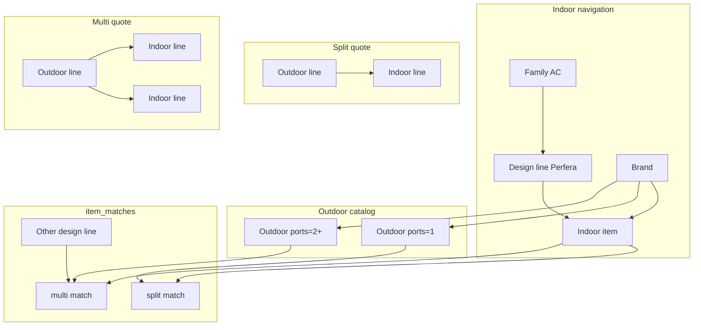

# AC pairing: split vs multi, indoor design lines

Two install shapes, and the catalog must stop pretending they share a “range” name.

- **Split:** 1 outdoor + **1** indoor. Simple pair.
- **Multi-split:** 1 outdoor + **2 or more** indoors (up to that outdoor’s ports).

Names like Perfera, Sensira, Stylish are **indoor design lines** (look of the wall/floor unit). They were reused as sub-families for outdoor rows too; that was already a bad fit. Outdoor SKUs do not belong under those names.

## Locked decisions

- **One `items` table.** Do not split into AC exterior / AC interior tables. Do not put `interior.exterior_id` on the catalog.
- **Family** = product class. Seed **Air conditioners only**. Hide the family picker while there is one live family.
- **Sub-family** = **indoor design line only** (Perfera, …). Required on indoor items. **Null on outdoor items.** UI label can become “Design line”; pairing does not use this table.
- **Outdoor catalog identity:** brand + power + `max_indoor_ports` (1 = split outdoor, 2+ = multi outdoor) + internal code. No design line.
- **Pairing:** `item_matches` (M:N, may cross design lines) + grouped quote lines (`parent_line` = the outdoor line).
- **Quote entry:**
  - **Split:** design line → indoor SKU → matched outdoor (`ports=1`), auto when there is a single default match.
  - **Multi:** outdoor (`ports≥2`) → pick 2+ compatible indoors from any design line.

The outdoor line is still the **system parent** on the proforma in both flows. Indoor-first is pick order only, not the FK direction.

## Why the old tree was wrong

The drawer is Family → Sub-family → Manufacturer → Item, and seeds create Sensira indoor **and** Sensira outdoor at the same BTU. That only models 1:1 split-as-same-name. Multi-split outdoors are a different product; indoor design lines stay Perfera / Stylish / etc.

## Conceptual schema (no code yet)

- **families:** product class. One seeded row (Air conditioners). No Underfloor / DHW until those slices.
- **sub_families:** indoor design lines. Optional manufacturer lock stays (Perfera → Daikin). Belong to a family. **Not** attached to outdoor items. Not a pairing parent.
- **items:**
  - Indoor: `kind=indoor`, `sub_family` required, `max_indoor_ports` unused, `max_volume_m3` optional as today.
  - Outdoor: `kind=outdoor`, `sub_family` null, `max_indoor_ports` required (≥1).
  - Live uniqueness: indoor `(sub_family, brand, power)`; outdoor `(brand, power, max_indoor_ports)` (plus unique `internal_code` as today). Confirm at docs time if two split outdoors can share brand+power.
- **item_matches:** `outdoor` + `indoor` + optional `is_default` for split auto-pick. Live unique `(outdoor, indoor)`. Indoor design line need not match anything on the outdoor (outdoor has none).
- **proforma_lines.parent_line:** null on outdoor line; indoor lines point at it. Child count = 1 for split, 2..ports for multi. Extra tubing stays on indoor lines.

Validation: outdoor parent on same draft; indoor count ≤ ports; split must be exactly 1 indoor; each indoor in `item_matches` for that outdoor.

## Greenfield seed (rewrite entirely)

Local path: `rm -f db.sqlite3`, `migrate`, `seed_demo`. No production data. `seed_demo` still calls `seed_catalog`; both are rewritten. Users, clients, and sites stay as they are (same emails, NIFs, Cascais / Oeiras / Alfama / etc.). Catalog and quotes do not.

### Catalog (`seed_catalog`)

- One family: Air conditioners. Do not seed Underfloor heating or DHW.
- Design lines (sub-families), indoor only:
  - Generic **Split** (default, no manufacturer lock) for Mitsubishi / LG / Nippon wall units.
  - Daikin-locked: Sensira, Comfora, Perfera, Perfera Floor, Stylish, Emura, Ururu Sarara.
- Indoor items: 9000 / 12000 / 18000 BTU per design line, with today’s placeholder indoor prices. Codes like `DAI-EMU-I-12`. 9k indoor still gets `max_volume_m3=20`.
- Outdoor items: **not** cloned per design line. Per brand:
  - Split outdoor: `max_indoor_ports=1` at 9k / 12k / 18k. Codes like `DAI-O1-12` (no Sensira in the code).
  - One Daikin multi outdoor: `max_indoor_ports=2` at 18000 BTU, code `DAI-O2-18`. Enough to demo multi; no capacity math.
- `item_matches`:
  - Split: each indoor matches that brand’s ports=1 outdoor at the **same BTU**, `is_default=True`.
  - Multi: Daikin `DAI-O2-18` matches a small mix of Daikin 9k/12k indoors across design lines (at least Emura 12k and Emura 9k so Cascais can use them).

Mitsubishi / LG / Nippon: 3 indoors + 3 split outdoors each. No multi outdoors for those brands in this seed.

### Demo quotes (`seed_demo`)

Keep document-life coverage (issued, draft, accepted, rejected, Change/supersede, extra tubing 8 m). Change **systems** to match split vs multi:

- **Moradia Cascais** (issued + Change draft): **one multi-split** — Daikin 2-port outdoor + Emura 12k indoor (5 m tubing) + Emura 9k indoor (3 m tubing). Same 8 m header, one outdoor not two. Observations: house, two rooms, one outdoor.
- **Bloco Oeiras** (draft): Mitsubishi **split** 9k (Split design line + ports=1 outdoor).
- **Apartamento Alfama** (issued, accepted): LG **split** 18k + 10 m tubing.
- **Ala Norte** (issued, rejected): Daikin Comfora **split** 9k.
- **Spa** (draft): Daikin Perfera Floor **split** 12k.
- **Receção** (issued, eligible for Change): Daikin Sensira **split** 12k.

Idempotent still. `_add_lines` becomes system-aware (outdoor parent + indoor children), not independent peer lines.

### Tests to rewrite with the seed

- [`proformas/tests/test_seed_demo.py`](proformas/tests/test_seed_demo.py) — Cascais is one outdoor + two indoor lines; still 8 m tubing; quote counts can stay if Change still adds the seventh row.
- [`proformas/tests/test_phase3.py`](proformas/tests/test_phase3.py) — stop asserting 6 items per Daikin sub-family (that was indoor+outdoor under the same name); assert indoor-only under Perfera, shared split/multi outdoors, match rows.

## Quoting UX (implement later)

Staff choose **Split** or **Multi** (or the outdoor’s port count implies it).

- Split: Family hidden → manufacturer → design line → indoor → outdoor (`ports=1`) from matches, auto if one default.
- Multi: Family hidden → manufacturer → outdoor (`ports≥2`) → add indoor lines from the match list, each with its own design-line filter.

PDF/work page: group lines as one system (outdoor heading, indoor rows under it).

## Out of this slice

- Capacity math (sum of indoor BTU vs outdoor)
- Two product tables
- Heating/DHW content
- Issued snapshot redesign beyond grouping and a null design-line snapshot on outdoor lines

## After go-ahead to write docs (not code)

1. Append dated update to [`docs/preliminary_project-plan.md`](docs/preliminary_project-plan.md).
2. Rewrite [`docs/data-points.md`](docs/data-points.md): `sub_families` purpose = indoor design line; `items.sub_family` indoor-only; outdoor identity; `item_matches`; `parent_line`; drop deferred `model_default_matches`.
3. Ask whether to checkbox this into [`docs/project-plan.md`](docs/project-plan.md).
4. Implement only after that.
