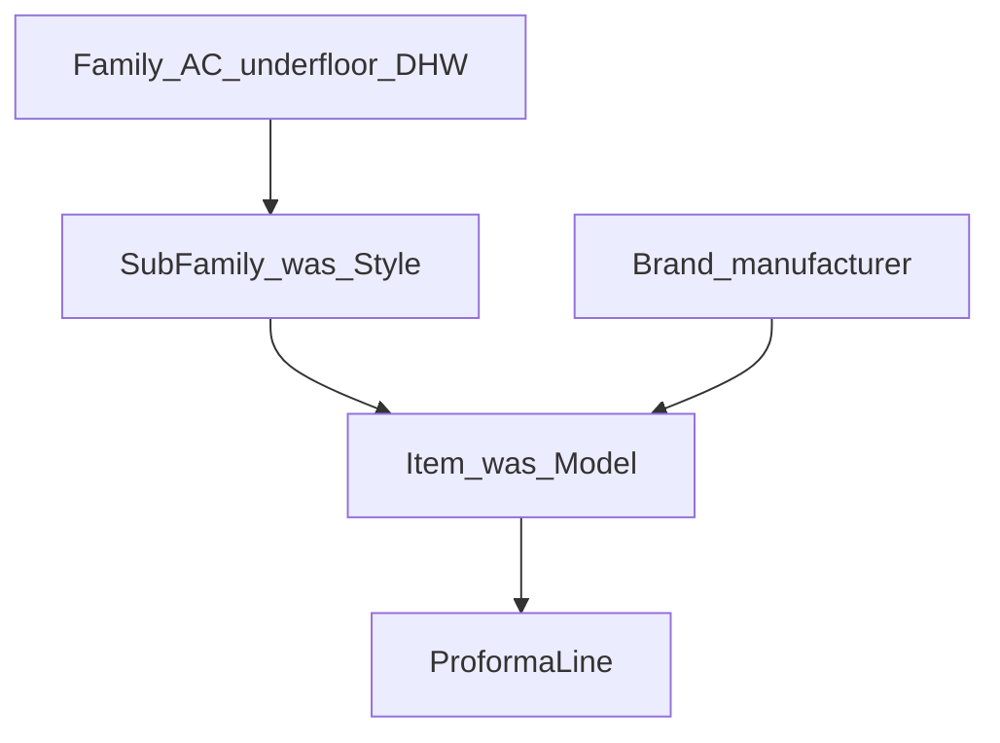

# Catalog: family, sub-family, item, dashboard config

Greenfield (fresh DB is fine). Do **not** copy warehouse stock, VAT, UoM, supplier POs, JSON item APIs, or a Master-data cluster **on the items page**.

This app needs **one more catalog layer than warehouse**: warehouse is family → sub-family → item; here the item also belongs to a **manufacturer** (`Brand`). Compared with today’s schema, the **new** layer is Family. Today’s Style becomes Sub-family; today’s EquipmentModel becomes Item.

**Django admin is not the catalog UI.** Staff manage families, sub-families, manufacturers, items, and sales prices on staff pages. Admin stays for users, audit, and leftovers (tubing/parameters) until those get their own cards later.

## Hierarchy

Family is a product category (season / job type), not a Daikin range name:

- **Air conditioners** (default — most sold)
- **Underfloor heating**
- **Domestic hot water** (AQS / baths; name can be edited later)

Sub-family is the named range (Sensira, Perfera, Split, …). It belongs to a **family**, not to a brand.

Line drawer pick order: **Family → Sub-family → Manufacturer → Item**.

## Dashboard cards (two groups)

[`templates/dashboard.html`](templates/dashboard.html) gets two card grids so daily work stays uncluttered. Config is reached from **dashboard cards**, not from the work topbar and not from `/admin/`.

**Daily**

- Clients
- Sites
- Proformas
- Items (the working catalog)

**Setup** (more cards will be added later)

- Families
- Sub-families
- Manufacturers (name + **sales pricelist**)

Work topbar nav stays daily only: Home, Clients, Sites, Proformas, **Items**. No Families / Sub-families / Manufacturers in the nav.

Remove the admin-only “Catalog (Django admin)” card from the dashboard. Admin can still open `/admin/` for users/audit if needed; it is not a catalog surface.

## Defaults

`is_default` on Family, SubFamily, Brand, and Item. Opening a new line pre-selects every default in the cascade.

- At most one live default **family** (seed: Air conditioners)
- At most one live default **sub-family per family** (seed: Split under AC)
- At most one live default **brand** (do not invent one in seed)
- At most one live default **item per** (sub_family, brand)

## Sales price = manufacturer pricelist

`list_price` stays on `Item` (one manufacturer per item, so that row **is** the manufacturer’s sales price). **No price field on the Items page** (create or edit). Set and change sales price only on the manufacturer pricelist. Price changes still require a reason (`change_logs`).

New items start at `0.00` until priced on the manufacturer page. Quoting copies whatever `list_price` is at save/issue (same snapshot rules as today).

## Optional coverage volume (future automation)

Add **`max_volume_m3`** on `items`, optional (null = unknown / not applicable). Meaning: this unit is suitable **up to** that room volume. Example: a 9000 BTU indoor is ideal until **20 m³**.

Outdoor units, underfloor, DHW, and any item without a rule leave it blank. **Do not** build auto-pick / room-size matching in this slice — store the datapoint so a later agent can suggest items from site volume. No snapshot on `proforma_lines` yet (matching will read the live catalog).

Show and edit it on the Items drawer (spec next to BTU, not on the pricelist). Seed the example on 9000 BTU indoor rows (`20`); leave other capacities blank unless a real figure is supplied.

## 1. Docs first

Rewrite catalog in [`docs/data-points.md`](docs/data-points.md):

- `brands` (UI: manufacturer): `name`, `is_default`
- `families`: `name`, `is_default`; live unique name (case-insensitive)
- `sub_families` (was `styles`): `family` FK, `name`, `is_default`; not brand-owned
- `items` (was `models`): `sub_family` FK, `brand` FK, `internal_code`, `kind`, `btu`, `max_volume_m3` (optional), `list_price`, `is_default`
- Internal code: store uppercase; live uniqueness compared case-insensitive
- `proforma_lines`: FK `item`; snapshots `family_name`, `sub_family_name`, `brand_name`, `internal_code`, `kind`, `btu`

Append [`docs/preliminary_project-plan.md`](docs/preliminary_project-plan.md). Rewrite the catalog/admin bits of [`docs/front-end-project-plan.md`](docs/front-end-project-plan.md): dashboard daily vs setup cards; Items is a light work page; Families / Sub-families / Manufacturers are setup pages; line cascade; **no** Django admin catalog. Append [`docs/project-plan.md`](docs/project-plan.md).

## 2. Schema and services

[`proformas/models.py`](proformas/models.py): `Family`; `Style` → `SubFamily` (`family` FK, not `brand`); `EquipmentModel` → `Item` including optional `max_volume_m3`; `is_default` on Family, SubFamily, Brand, Item; `ProformaLine.model` → `item`; `style_name` → `sub_family_name`; add `family_name` + `internal_code` snapshots.

Migration `0002`. Fresh DB: migrate + `seed_demo`.

[`proformas/services.py`](proformas/services.py): normalize internal code (strip, `.upper()`, `[A-Za-z0-9._-]`, live `iexact`); default-flag helpers; `update_equipment_list_price` used **only** from the manufacturer pricelist page. Issue snapshots walk `item.sub_family.family`.

Seed: AC (default), Underfloor heating, Domestic hot water; AC sub-families Split (default) + Sensira / Comfora / … (global); Mitsubishi/LG/Nippon on Split; Daikin on named ranges; codes like `DAI-SEN-I-9`; 9000 BTU indoor `max_volume_m3=20`, other capacities left null.

Unregister Family / SubFamily / Item / Brand from being “the” catalog UI in [`proformas/admin.py`](proformas/admin.py) (drop Style). CLI [`create_proforma`](proformas/management/commands/create_proforma.py) takes item ids.

## 3. Staff pages

Same list+drawer chrome as clients.

**Items** (daily, light): search + filter by family / manufacturer; **New item**; grid: code, family, sub-family, manufacturer, kind, BTU, max m³ (price **read-only** at most, not editable here); drawer: family, sub-family, manufacturer, internal code, kind, BTU, max volume m³ (optional), default — **no sales price**.

**Families**: name, default.

**Sub-families**: family, name, default; filter by family.

**Manufacturers**: list of brands (name, default). Row opens that manufacturer’s **sales pricelist** (that brand’s items: code, sub-family, kind, BTU, sales price). Edit price in a drawer with **reason**. This is “our sales price”, not a supplier cost.

Staff may create/edit these rows; only admin soft-deletes (same as clients).

i18n: `items`, `family`, `subFamily`, `manufacturer`, `internalCode`, `pricelist`, `salesPrice`, `setup`, `default`, `maxVolumeM3`, …

## 4. Line drawer cascade

[`templates/proformas/includes/line_form.html`](templates/proformas/includes/line_form.html) + [`ProformaLineForm`](proformas/forms.py): Family → Sub-family → Manufacturer → Item (only item is the posted FK). Defaults pre-selected on new line. Plain JS, no JSON API. Quantity / extra tubing / tubing length unchanged.

## 5. Tests and check

Codes, shared sub-families across brands, one live default family, staff can open setup pages without admin, price update requires reason on pricelist (not on items POST), seed idempotent, issue snapshots. Browser: dashboard shows daily + setup cards; Items drawer has no price; Manufacturers pricelist edits a price; new line starts on AC.
