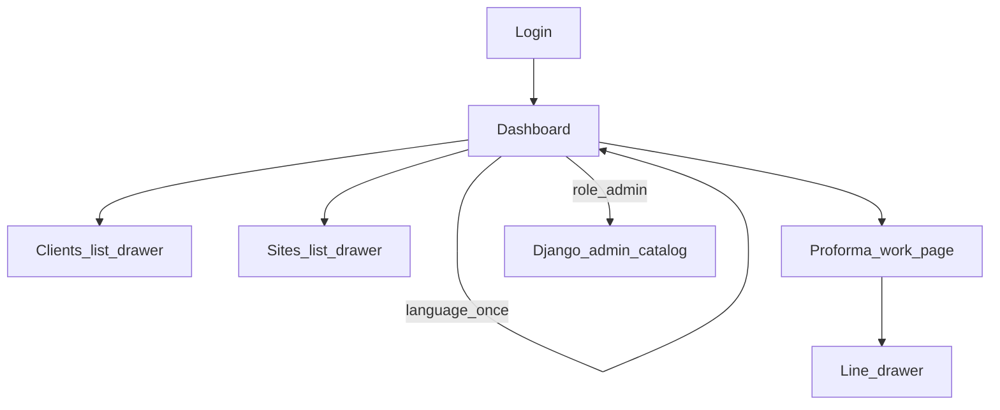

# Front-end playbook from warehouse_V2

## What we will write

A new living spec: [`docs/front-end-project-plan.md`](docs/front-end-project-plan.md). It tells a later agent **how the staff UI should look and behave**. Product scope stays in [`docs/preliminary_project-plan.md`](docs/preliminary_project-plan.md); implementation order stays in [`docs/project-plan.md`](docs/project-plan.md).

Also **amend Phase 1** in [`docs/project-plan.md`](docs/project-plan.md): language is chosen **once on the dashboard**, not in the work-page nav (warehouse D38). Point agents at the new front-end doc from the playbook “How to use” block and from [`AGENTS.md`](AGENTS.md) living-docs table.

No application CSS/HTML yet. Do not edit `.cursor/plans/`.

## Reference (warehouse_V2)

Source: [neopmpmtj/warehouse_V2](https://github.com/neopmpmtj/warehouse_V2)

| Pattern | Where | Copy into fri-uni |
| --- | --- | --- |
| Dashboard language once | `products/templates/products/includes/preferences_bar.html` + `preferences_bar.js` on **dashboard only** | Yes (`fu-lang` localStorage + cookie). **No theme toggle** |
| Gear / Settings top-right | `account_settings.html` + `settings_menu.css` | Yes: signed-in email + Sign out. Skip Help manuals and “sign out other devices” |
| Work chrome | `item_console.html` header: eyebrow, `h1`, topbar nav, actions | Yes |
| List + drawer | Items: toolbar, `.grid` table, `#drawer` + `#drawer-backdrop` | Yes for clients, sites, and proforma **lines** |
| Nested master data | Items “Master data” → Families / Suppliers **drawers**, not separate pages | Do **not** nest sites inside clients. Sites are first-class (a proforma belongs to a site) with their own list+drawer page |
| Catalog console | `catalog.html` | **Do not copy.** Catalog stays Django admin (already locked) |

Visual tokens from `products/static/products/css/console.css` (light only): `--bg #f4f6f8`, `--surface #fff`, `--accent #0f766e`, `--border #d5dde6`, `--text #1c2430`, `--muted #5b6776`, system-ui font, 6–8px radii, teal primary buttons.

## Document shape (`docs/front-end-project-plan.md`)

Keep it agent-executable: chrome rules, screen inventory, what **not** to copy, checkboxes dated 2026-09-06.

### 1. Chrome rules (always)

- Plain HTML/JS. Shared `templates/base.html` is **not** enough: dashboard vs work page are two layouts (warehouse does this).
- **Dashboard layout:** top `page-account-bar` = language `<select>` + gear. Main = title + **card grid** (Clients, Sites, Proformas; Catalog/Admin card only if `role=admin`).
- **Work layout:** `header.topbar` = eyebrow + page `h1` + nav (Home, Clients, Sites, Proformas) + **no language select** + gear. `main.page` = toolbar + table.
- Gear popover: “Settings”, “Signed in as **email**”, Sign out (POST logout). Click-outside and Escape close it.
- i18n: warehouse JS pattern; English fallback in HTML; work pages **read** `fu-lang` only.
- Drawer: right-hand panel, backdrop, form in `.drawer-body`, Close in head, Escape/backdrop closes. Create and edit use the same drawer.

### 2. Screens

- **Login** — simple centered form; English fallback + i18n.
- **Dashboard** — only place to set language.
- **Clients** — search/filter toolbar, `.grid`, New client, row opens drawer (name, phone, email). Soft-delete in drawer/actions. Analog of warehouse **Items**.
- **Sites** — same pattern; filter by client; drawer fields from data-points (`alias_1` required, address optional). Analog of warehouse **Items**, not of nested Suppliers.
- **Proforma list** — table of drafts/issued/cancelled; New draft (pick site).
- **Proforma work page** — header fields on the page (discount, extra labour, observations, issue/cancel). Lines as a `.grid`. **Add/edit line in a drawer** (model, qty, extra tubing + length). Issued: read-only + “View quote” / “Download PDF” (Phase 7). Analog of a warehouse console, not a Django form wizard.
- **Issued quote view** — document-like on-screen page (Phase 7); can be simpler than the console; still uses work-page topbar.

### 3. Out of the front-end copy

Dark theme, Help `?` + user manuals, “sign out other devices”, JSON APIs / SPA table rendering **required** (warehouse items are JS+API; fri-uni may server-render the table and only use JS for drawer/open/i18n — say so: **server-rendered tables + JS drawer**, no `/api/manage/` clone unless a later page needs it), warehouse “Master data” cluster, Company Voice, branch cards.

### 4. Tie-in to implementation phases

- Phase 1 delivers dashboard + work shell + gear + i18n (language **only** on dashboard).
- Phase 4 clients/sites = list+drawer, not `client_form.html` full pages.
- Phase 5–6 proforma = work page + line drawer.
- Phase 7 quote view + PDF.

## Amend [`docs/project-plan.md`](docs/project-plan.md)

- How to use: also read `docs/front-end-project-plan.md` before UI work.
- Phase 1 notes: remove “language `<select>` in the nav”. Home **is** the dashboard. Work pages have no language control.
- Phase 4 files: list templates + shared drawer include, not separate form pages as the primary UX.

## Amend [`docs/preliminary_project-plan.md`](docs/preliminary_project-plan.md)

Append a short dated update: chrome copied from warehouse_V2; language dashboard-only; list+drawer; no dark theme / help manuals.

## Explicitly not in this write

No CSS/JS implementation. Catalog remains Django admin (no items-console clone for brands/models).