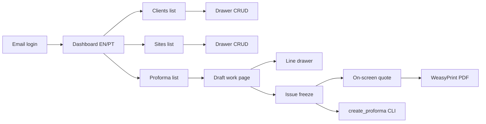

# Full staff app (`proformas`)

Override the usual one-phase-per-chat stop: implement Phases 1–8 in **order** in this session. Run that phase’s pytest before starting the next. Do not invent tables or chrome that contradict [`docs/data-points.md`](docs/data-points.md) and [`docs/front-end-project-plan.md`](docs/front-end-project-plan.md).

**App name:** `proformas` (not `office`). All services, models, admin, management commands, and staff templates live there. `accounts` stays the login User app.

**Rename in living docs** (not [`.cursor/plans/`](.cursor/plans/)): replace `office` with `proformas` in [`docs/project-plan.md`](docs/project-plan.md), [`docs/handoff.md`](docs/handoff.md), [`AGENTS.md`](AGENTS.md), [`docs/front-end-project-plan.md`](docs/front-end-project-plan.md) template paths, and a short append on [`docs/preliminary_project-plan.md`](docs/preliminary_project-plan.md).

```text
views / management commands  →  proformas/services.py  →  models.py
```



Already in repo: [`accounts/models.py`](accounts/models.py) (email User, unused OAuth flags), [`conf/settings/base.py`](conf/settings/base.py), [`conf/urls.py`](conf/urls.py) (admin only), pytest-django. No templates/static yet. No `office`/`proformas` app.

---

## Phase 1 — Login, `role`, dashboard, i18n, work shell

- Extend [`accounts/models.py`](accounts/models.py) with `role` (`staff` | `admin`). Default `staff`. `create_superuser` sets `role=admin`. On save, `role=admin` → `is_staff=True`; `role=staff` → `is_staff=False`. No always-on audit columns on User. No `language` column.
- [`accounts/admin.py`](accounts/admin.py): show/edit `role`; leave OAuth fields unused.
- Settings: `LOGIN_URL`, `LOGIN_REDIRECT_URL` (dashboard), `LOGOUT_REDIRECT_URL`, `TEMPLATES["DIRS"]` → `templates/`, `STATICFILES_DIRS` → `static/`. Keep `LANGUAGE_CODE = "en-gb"`. No gettext UI.
- Auth views: `django.contrib.auth` login/logout. Home **is** the dashboard (`login_required`).
- Templates: `templates/registration/login.html` (centered card); `templates/dashboard.html` (language `<select>` + gear + cards: Clients, Sites, Proformas; Catalog/Admin card only if `role=admin`); `templates/work_base.html` (eyebrow, h1, nav Home/Clients/Sites/Proformas, gear; **no** language select); `templates/includes/account_settings.html` (gear: Settings, email, POST Sign out). One stub work page so tests can assert work chrome has no language control (real lists come in Phases 4–5).
- i18n: [`static/js/i18n.js`](static/js/i18n.js) with `normalizeLang` (`pt*` → `pt`), `t()`, `applyStaticI18n()`, `safeGet`/`safeSet`; key `fu-lang` in **localStorage and cookie**; event `fu-lang-changed`. English fallback in HTML + `data-i18n*`. Early `<head>` script sets `document.documentElement.lang` to `en` or `pt-PT`. Tiny Python `normalize_lang` (same rule) for tests.
- CSS tokens from the front-end plan (light only): `--bg` `#f4f6f8`, `--accent` `#0f766e`, etc. Dashboard + topbar + gear popover. Copy warehouse *chrome*, not warehouse product screens.
- Tests (accounts): anonymous `/` → login; `role=staff` cannot use `/admin/`; `normalize_lang("pt-PT") == "pt"`; dashboard contains language select, work base does not.

---

## Phase 2 — Domain models

Create app `proformas`, add to `INSTALLED_APPS`.

- Abstract always-on mixin: `created_at`, `updated_at`, `created_by`, `updated_by`, `deleted_at`, `deleted_by`. Live manager (default queryset `deleted_at` is null) plus `all_objects`.
- Models from data-points: `Parameter`, `Client`, `Site`, `Brand`, `Style`, `EquipmentModel` (catalog machine; one-line comment that this is data-points `models`), `TubingLength`, `Proforma`, `ProformaLine`, `ChangeLog`, `ActivityLog`. Money as `DecimalField`. Enums as `TextChoices`.
- Live uniqueness via `UniqueConstraint` with `condition=Q(deleted_at__isnull=True)` (client name, brand name, style per brand, style+kind+btu, tubing length, parameter key, proforma number). If SQLite rejects a partial index, enforce the same rule in services and document it — do not weaken PostgreSQL.
- [`proformas/services.py`](proformas/services.py): `log_change(...)`, `log_activity(...)` only in this phase. No issue/lock yet.
- Tests: two live clients with the same name fail; a soft-deleted name can be reused.

---

## Phase 3 — Catalog admin + seed

- Admin (English): Brand, Style, EquipmentModel, TubingLength, Parameter; ChangeLog/ActivityLog read-only. Staff still cannot open `/admin/`.
- Reason-required: changing `list_price` or tubing `price` requires `reason` and writes `change_logs`. Create does not need a reason. Logic in services, not a second copy in `save_model`.
- `seed_catalog`: Mitsubishi, LG, Nippon; a few styles; indoor/outdoor at 9k/12k/18k with round list prices; a few metre lengths; parameters `currency=EUR`, `default_upfront_discount_percent=10`, `tubing_length_unit=m`. Idempotent. Not called from deploy.
- Tests: price update without reason fails; with reason writes a log; seed twice does not duplicate live brands.

---

## Phase 4 — Clients and sites UI

- Login-required views for both `staff` and `admin`. Server-rendered tables + shared right-hand drawer ([`templates/includes/drawer.html`](templates/includes/drawer.html)). **Sites are a first-class list**, not nested under the client drawer.
- Client: name required; phone/email optional. Site: client + `alias_1` required; aliases 2–4, street, postal_code, city, notes optional.
- Soft-delete from the drawer; lists use the live manager.
- Wire URLs in [`conf/urls.py`](conf/urls.py). i18n keys on new strings.
- Tests: staff can create a client and a site; duplicate live client name rejected.

---

## Phase 5 — Draft proformas and lines

Services only for math/numbering:

- `create_draft`: number `PF-YYYY-NNNN` (create year + 4-digit live sequence); copy default discount from parameters; `extra_labour=0`.
- Lines: one machine each; `unit_price` = current list price; extra tubing boolean → length required and `tubing_amount` = that price, else 0; `line_total = quantity × (unit_price + tubing_amount)`.
- Live header (not frozen yet): equipment subtotal = sum `qty × unit_price`; tubing total = sum `qty × tubing_amount`; discount on **equipment only**; `grand_total = equipment - discount + tubing + extra_labour`.
- UI: proforma list (filter status, New draft must pick a site) + work page (header fields on the page, lines `.grid`, add/edit line in the shared drawer). No PDF.
- Tests: first-of-year number; tubing formula; discount ignores tubing and labour.

---

## Phase 6 — Issue, freeze, cancel

- `issue_proforma`: copy snapshot fields from data-points (client name/phone/email; site aliases/address/notes; line brand/style/kind/btu/tubing_length_value); freeze money totals and line money; `status=issued`; activity log.
- Refuse money/header/line edits when `status != draft`.
- `cancel_proforma`: status only; does not unlock; activity log.
- Issued work page read-only (View quote / Download PDF land in Phase 7).
- Tests: catalog reprice and client rename do not change issued snapshots; issued money update rejected; cancel does not return to draft.

---

## Phase 7 — On-screen quote + PDF

- Issued HTML reads **snapshots**, not live names. Work topbar remains.
- `build_proforma_pdf(proforma) -> bytes` (WeasyPrint). Do not store files. Do not send email.
- [`proformas/quote_i18n.py`](proformas/quote_i18n.py): small EN/PT dict; language from `fu-lang` cookie (`en` default).
- Letterhead: placeholder company name in the quote template (handoff left logo/address open — do not add undocumented parameter keys).
- Add WeasyPrint to [`requirements.txt`](requirements.txt); note Debian `pango`/`cairo` packages in [`docs/DEPLOYMENT.md`](docs/DEPLOYMENT.md).
- Tests: HTML shows snapshot `client_name`; PDF `application/pdf` with non-empty body; `fu-lang=pt` includes a known Portuguese label.

---

## Phase 8 — CLI

- `proformas/management/commands/create_proforma.py` calls services only.
- Mandatory: `--user` (email → `created_by`), `--site`, at least one `--line` (`model_id:qty` or `model_id:qty:tubing_length_id`). Optional: `--discount-percent`, `--extra-labour`, `--observations`, `--issue`.
- Tests: draft + number + `created_by`; `--issue` freezes; bad user/site fails clearly.

---

## Out of this build

Email send, stored PDFs, Google OAuth login, gettext, dark theme, `model_default_matches`, unlock/revise issued quotes, nested site drawers, warehouse JSON APIs / catalog console.

## Verification

No browser MCP in this session. After UI phases: pytest plus `curl` against `runserver` for login redirect, dashboard 200, and PDF content-type. Call out that click/drawer behaviour is not browser-exercised.

## Session close

When the build is in: tick phase checkboxes in [`docs/project-plan.md`](docs/project-plan.md) and front-end chrome checkboxes; rewrite [`docs/handoff.md`](docs/handoff.md) via session-handoff.
