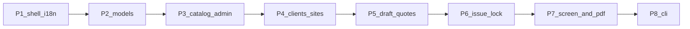

# Phased implementation playbook

## What will be written

Replace the empty [`docs/project-plan.md`](docs/project-plan.md) with a **phased implementation plan**, not a copy of product scope. Scope and schema stay in [`docs/preliminary_project-plan.md`](docs/preliminary_project-plan.md) and [`docs/data-points.md`](docs/data-points.md). This file tells a later agent **what to build, in what order, which files, and which tests**.

Also append `## Update 2026-09-06` (warehouse_V2 JS i18n + on-screen quote + PDF-for-later-email) to [`docs/preliminary_project-plan.md`](docs/preliminary_project-plan.md) so those decisions are not only in the backlog. When writing [`docs/project-plan.md`](docs/project-plan.md), point agents at warehouse_V2 `docs/i18n-pattern.md` as the UI translation spec (do not re-copy that whole file).

Each phase is independently stoppable: models migrated, tests green, UI usable for that slice. A new agent reads handoff + this file, implements **one phase**, ticks checkboxes, then session-handoff.

## Locked decisions (from this session)

- **Surfaces:** Django contrib admin for catalog, parameters, users, audit. Custom templates for clients, sites, proforma draft → issue → on-screen quote → PDF.
- **Login:** email + password only. Google OAuth fields stay unused.
- **i18n:** copy **CentCompras / warehouse_V2**, not Django gettext. Source of truth: [neopmpmtj/warehouse_V2](https://github.com/neopmpmtj/warehouse_V2) [`docs/i18n-pattern.md`](https://github.com/neopmpmtj/warehouse_V2/blob/main/docs/i18n-pattern.md). English fallback in HTML; vanilla JS dictionaries + `data-i18n*` attributes; `en` | `pt` (normalize any `pt*` to `pt`; dicts may key `"pt-PT"` with a `pt` alias). Preference in `localStorage` (key `fu-lang`). Language `<select>` in the staff shell (dashboard-style, like `preferences_bar.html`). **No** `.po` files, **no** `LocaleMiddleware` / ``, **no** `User.language` column. Do **not** port dark/light theme unless asked later.
- **PDF / quote language:** WeasyPrint cannot read `localStorage`. When the user changes language, JS also writes a `fu-lang` cookie so the on-screen quote and PDF pick `en` or `pt` from a small **server-side string dict** (same keys as the JS quote dictionary). Switch language before download for a UK client. Django admin stays English (contrib admin).
- **PDF:** on-screen issued quote is the MVP visualization. Also generate a real PDF (`bytes`) on download so a later email feature can attach it. **Do not send email** in this plan. Do not store PDF files.
- **Seed:** `seed_catalog` management command (idempotent, optional, not auto-run in prod).
- **CLI:** last phase, contract already in data-points.

## Architecture every phase must follow

```text
views / management commands  →  office/services.py  →  models.py
```

- New Django app **`office`** for all domain tables. Keep **`accounts`** for `User`.
- Plain Django templates + a little JS. Project [`templates/`](templates/) + [`static/`](static/).
- Issued proformas are frozen; money math and lock live in `office/services.py` (never in templates).
- Tests: **pytest-django**, a few tests per phase (formulas, lock, permissions, i18n smoke). No Selenium, no coverage gates.

**User vs data-points:** extend [`accounts/models.py`](accounts/models.py) with `role` (`staff` | `admin`) only. Map `role=admin` → `is_staff=True` (Django admin). `role=staff` cannot open `/admin/`. Language is **not** a user column (browser `localStorage` + cookie, same idea as warehouse `cc-lang`). Do **not** retrofit full always-on audit columns onto `User`. All `office` entities get always-on columns from data-points.



## Document shape (what goes in `docs/project-plan.md`)

Opening block: how to use (one phase per session, read data-points before models, tick `[x]` on handoff).

Then **Phase 1–8**, each with: goal, done-when, files, implementation notes, tests, checkbox tasks dated `2026-09-06`.

### Phase 1 — Login, roles, i18n, staff shell

Working when: staff can sign in, switch EN/PT in the header (no flash of the wrong `lang`), see a logged-in shell; staff cannot open Django admin.

- Login/logout via `django.contrib.auth` views; `LOGIN_URL` / redirect home.
- Port the warehouse_V2 recipe (short form, one shared dictionary for chrome — not a per-page file explosion):
  - `static/js/i18n.js` — `normalizeLang`, `t()`, `applyStaticI18n()`, `safeGet`/`safeSet`, `fu-lang` in localStorage **and** cookie
  - `templates/base.html` — English fallback copy, `data-i18n` / `data-i18n-placeholder` / `data-i18n-aria`, early `<head>` script setting `document.documentElement.lang` (`en` or `pt-PT`)
  - Language `<select>` in the nav (English / Português), like warehouse `pref-language`
  - Per later page: extra keys in the same dict or a page `*_i18n.js` if the page is large; do not invent Django `gettext`
- Keep `LANGUAGE_CODE = "en-gb"` (templates ship English). `USE_I18N` can stay True; it is unused for UI.
- `templates/base.html` nav: clients/sites/proformas; admin-only link to `/admin/` for `role=admin`.
- Tests: anonymous redirect; staff 403 on `/admin/`. i18n: one test that the i18n JS module (or a tiny Python mirror of `normalizeLang`) maps `pt-PT` → `pt`; optional client test that base template contains `data-i18n`. Do not add Selenium.

### Phase 2 — Domain models, audit, parameters

Working when: `migrate` creates all tables from data-points; no UI yet besides admin stubs.

- Models: `Parameter`, `Client`, `Site`, `Brand`, `Style`, `Model`, `TubingLength`, `Proforma`, `ProformaLine`, `ChangeLog`, `ActivityLog`.
- Soft-delete manager (`deleted_at` null = live); unique keys on live rows only.
- Helpers in `office/services.py` to write change/activity logs.
- Tests: live uniqueness; soft-deleted name can be reused.

### Phase 3 — Catalog + parameters in Django admin + seed

Working when: admin can enter brands → styles → models and tubing lengths; `seed_catalog` fills a demo catalog + default parameters (`currency`, `default_upfront_discount_percent`, `tubing_length_unit`).

- Reason-required: changing `models.list_price` or `tubing_lengths.price` requires a reason and a `change_logs` row.
- Tests: price change without reason fails; seed is idempotent.

### Phase 4 — Clients and sites (custom UI)

Working when: staff CRUD clients and sites (four aliases, optional address fields); lists hide soft-deleted rows.

- Tests: create client+site; staff can access; uniqueness on live client name.

### Phase 5 — Draft proformas and lines

Working when: staff create a draft on a site, add/remove lines, extra tubing per line, header discount/labour/observations; live totals on screen.

- Number `PF-YYYY-NNNN` assigned on create (year sequence).
- Line money: `unit_price` from current catalog; `tubing_amount` from length or 0; `line_total = qty * (unit_price + tubing_amount)`.
- Discount applies to equipment only (formulas in data-points).
- Tests: numbering; tubing/discount math; draft editable.

### Phase 6 — Issue, freeze, cancel

Working when: **issue** snapshots client/site/catalog display fields, freezes totals, sets `issued`; catalog price changes do not alter issued rows; **cancel** retires without unlocking; draft-only PDF is not this phase.

- All mutations through `office/services.py`.
- `activity_logs` on issue (and cancel).
- Tests: issued update of money fields rejected; snapshot stable after catalog rename/reprice.

### Phase 7 — On-screen quote + PDF download

Working when: issued quote is readable on screen; **Download PDF** returns a real file (WeasyPrint from the same HTML). PDF is not stored. Email send is **not** built; `build_proforma_pdf(proforma) -> bytes` is the attachment seam.

- Document Debian/WeasyPrint packages in [`docs/DEPLOYMENT.md`](docs/DEPLOYMENT.md).
- Quote chrome uses the warehouse JS pattern on screen; PDF/HTML file render uses a small Python dict keyed by the `fu-lang` cookie (`en` default). Same labels as the JS quote dictionary so EN/PT stay in sync.
- Tests: issued HTML shows snapshot names; PDF response `application/pdf` and non-empty bytes; PDF/HTML with `fu-lang=pt` contains a known Portuguese label. No visual-regression tests.

### Phase 8 — CLI (later slice, last in this plan)

Working when: `manage.py create_proforma --user --site --line ...` uses the same services as the web (optional `--issue`). Mandatory user is `created_by`.

- Tests: create draft; `--issue` locks; invalid user/site fails.

## Explicitly out of this document’s build

Email send, Gmail vs local mail, stored PDFs, Google OAuth, client portal, invoices/payments, `model_default_matches`, stock/jobs, unlocking issued quotes.

## Tests policy (for agents)

Prefer service tests over view tests. Roughly **2–6 tests per phase**. Do not add factories/frameworks unless needed; helper functions in `office/tests/` are enough.

## Not in this write

No application code, migrations, or `.cursor/plans/` edits. After you approve, only the two markdown files above are updated.